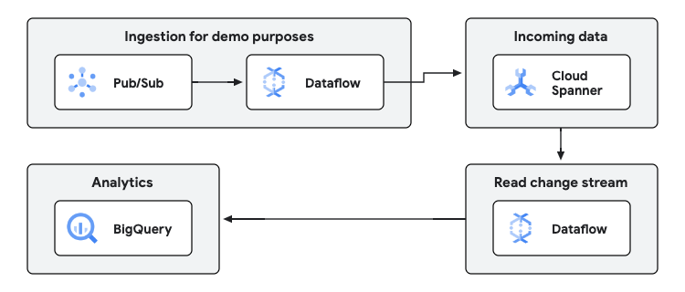

# ETL / integration

This pipeline demonstrates how to use Dataflow to create replicas of transactional databases, using change
streams, to create and maintain constantly updated replicas of the database.

The generic architecture for both looks like this:




## How to deploy

1. **Set the configuration variables:**
    - Create a file named `terraform.tfvars` in the current directory.
    - Add the following configuration variables to the file, replacing the values with your own:
      ```
      billing_account = "YOUR_BILLING_ACCOUNT"
      organization = "YOUR_ORGANIZATION_ID"
      project_create = TRUE_OR_FALSE
      project_id = "YOUR_PROJECT_ID"
      region = "YOUR_REGION"
      ```
    - If this is a production deployment, make sure you change also the optional variables.
2. **Initialize Terraform:**
    - Run the following command to initialize Terraform:
      ```bash
      terraform init
      ```
3. **Apply the configuration:**
    - Run the following command to apply the Terraform configuration:
      ```bash
      terraform apply
      ```
4. **Wait for the deployment to complete:**
    - Terraform will output the status of the deployment. Wait for it to complete successfully.
5. **Access the deployed resources:** You are now ready to launch the sample pipeline in this
   solution guide.

## Scripts generation

The Terraform code will generate a script with variable values.
The script is written in the location `scripts/01_set_variables.sh`, and should be executed as follows:

```bash
source ./scripts/01_set_variables.sh
```


## How to launch the pipelines

All the scripts are located in the `scripts` directory and prepared to be launched from the top
sources directory.

The Terraform code generates a file with all the necessary variables in the location `./scripts/01_set_variables.sh`.
Run the following command to apply that configuration:

```sh
source scripts/01_set_variables.sh
```

Then run the publisher pipeline. This pipeline will take data from the input 
topic, and will write it to Spanner.

```sh
./scripts/02_run_publisher_dataflow.sh
```

Once you have the publisher pipeline populating some data into Spanner, you 
can read from the change streams to replicate the database into BigQuery. 
For that, execute the following:

```sh
./scripts/03_run_changestream_template.sh
```

## Input data

All the input data is taken by default from the following public Pub/Sub topic:
* `projects/pubsub-public-data/topics/taxirides-realtime`

So you don't need to send any data anywhere to run this guide as an example.

## Output data

The BigQuery dataset (by default, `replica`) will contain a table (by default, 
called `events`, in the `taxis` database), with the same contents as the 
Spanner table. This replication will happen in real time with low latency, 
as new data lands in the Spanner table (or if any existing record is 
modified or deleted).

## How to remove

The setup will be continuously consuming as this is a streaming architecture, running without stop.

**BEWARE: THE COMMAND BELOW WILL DESTROY AND REMOVE ALL THE RESOURCES**.

To destroy and stop all the resources, run:

```bash
terraform destroy
```